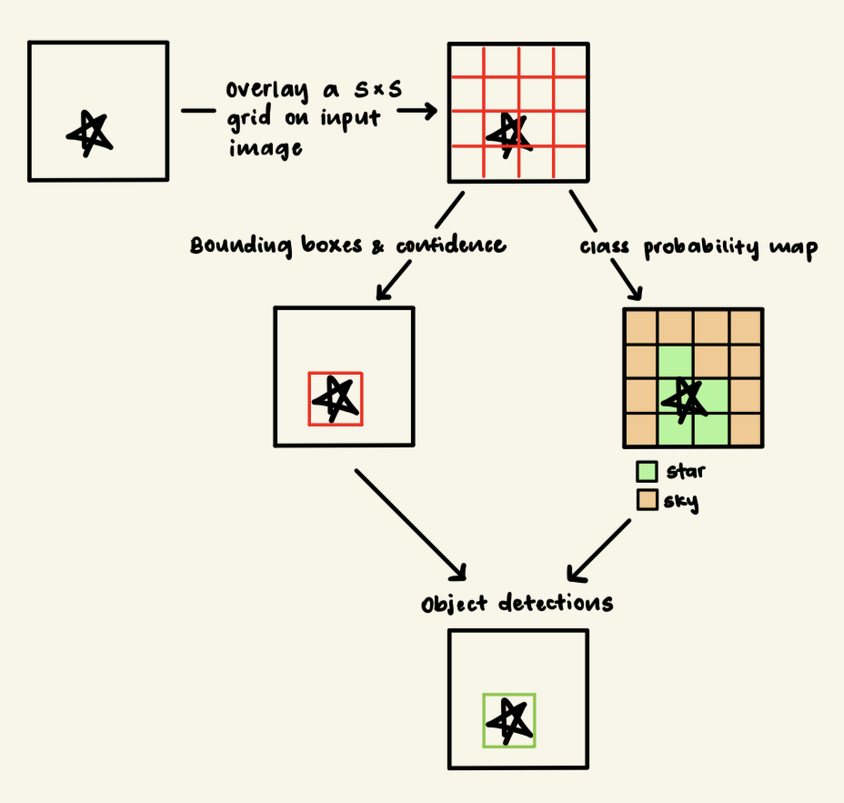

# Recognition Task 5: Lesions Detection with YOLOv7

### Description of Algorithm
This report uses the You Only Look Once (YOLO) v7 model. YOLO models are single stage object detectors which are, in turn, deep learning models that are able to find and identify objects in a single pass through the Convolutional Neural Network (CNN). Unlike two-stage object detectors, YOLO models immediately predict bounding boxes and classes from the image in a single pass. YOLO models are widely used for modeling object detection as they are faster, trainable on a single GPU, and can be used for real-time detection.

### How YOLOv7 Works
In a YOLO model, the input image is passed through the CNN's backbone. This step extracts important features that YOLO will use to find and classify objects. Such features may include: textures, shapes, and object edges. These features are combined by the "neck" using the Feature Pyramid Network (FPN), which passes information top-down. This enables YOLO to detect objects of varying sizes. In this report, YOLO is used to detect lesions. As the merged features are passed to the head of YOLO, bounding boxes, the confidence of the model regarding the existence of said object, and class probabilities are predicted. Each of YOLO's detection grid cell outputs a few of such predictions, which includes their respective confidence scores. Finally, YOLO uses Non-Maximum Suppression (NMS) to choose the bounding box with the highest confidence score, resulting in one box per object.

