# Recognition Task 5: Lesions Detection with YOLOv8

---

## Overview of Algorithm

### Description of Algorithm
This report uses the You Only Look Once (YOLO) v8 model. YOLO models are single stage object detectors which are deep learning models that are able to find and identify objects in a single pass through a Convolutional Neural Network (CNN). Unlike two-stage object detectors, YOLO models immediately predict bounding boxes and classes from the image in a single pass. YOLOv8 differs from its earlier versions by enabling anchor-free detection, whereby object centres' coordinates and bounding boxes dimensions are directly predicted instead of being predefined. YOLO models are widely used for modeling object detection as they are faster, trainable on a single GPU, and can be used for real-time detection. YOLOv8 achieves this with very high accuracy.

### How YOLOv8 Works
In a YOLO model, the input image is passed through the CNN's backbone. This step extracts important features that YOLO will use to find and classify objects. Such features may include: textures, shapes, and object edges. These features are combined by the "neck" using the Feature Pyramid Network (FPN) and Path Aggregation Network (PAN). This enables objects of varying sizes to be detected. In this report, YOLOv8 is used to detect lesions. As the merged features are passed to the anchor-free detection head of YOLOv8, bounding boxes, the confidence of the model regarding the existence of said object, and class probabilities are predicted. Unlike earlier versions, YOLOv8 is anchor-free and predicts object centers straightaway. Each of YOLO's detection grid cell outputs a few of such predictions, which includes their respective confidence scores. Finally, YOLO uses Non-Maximum Suppression (NMS) to filter overlapping boxes, resulting in one bounding box with the highest confidence score.

The figure below presents a simple diagram of YOLOv8's architecture and algorithm.

---

## Data Pre-processing

### Processing data for compatibility with YOLOv8
Firstly, each raw image and its corresponding mask is read. Subsequently, the regions where the lesions are located are extracted from these masks. These regions are then converted into bounding boxes and feature scaling occurs whereby coordinates are normalised. From these steps, we derive the YOLO-format labels (as of required of the algorithm) for each image which are saved as .txt files. An additional step of organising the file structure into images and labels separately was implemented. This was done to prevent confusion when handling the data in later parts.

### Training, Validation, Testing splits
The dataset provided already came with the training, validation, and testing splits of the data. I followed these splits as such. The dataset used in this project is the ISIC 2017 dataset. For the downloading of this dataset, the link will be provided under the "Dependencies and Reproducibility" section.

---

## Dependencies and Reproducibility

### Dependencies
Python libraries and their respective versions required have been placed into the "requirements.txt" file. For reference, the dependencies are also listed below.
    
    matplotlib==3.10.7
    numpy==2.2.6
    opencv-python==4.12.0.88
    PyYAML==6.0.3
    requests==2.32.5
    scipy==1.15.3
    torch==2.9.0
    torchvision==0.24.0
    ultralytics==8.3.218
    ultralytics-thop==2.0.17

### Reproducibility

Firstly, download the ISIC 2017 dataset from the link provided below if needed:

<https://challenge.isic-archive.com/data/#2017>

Once this repository has been cloned or downloaded, install dependencies by running:
    
    pip install -r requirements.txt

After all dependencies have been installed, run "dataset.py" just once to process the data. Once the data has been processed, run "train.py" to train, validate, test, and save the model.

Training parameters are as follows:

    data="/Users/suyi/Desktop/3710/ISIC-2017/isic2017.yaml",  # or replace with path to .yaml file
    epochs=num_epochs,                                        # number of training epochs
    imgsz=640,                                                # image size
    batch=8,                                                  # number of batches
    name="lesion_detector",                                   # name of run to be saved 
    project="runs/train",                                     # name of folder to be saved
    verbose=True                                              # True for printed detailed info as model progresses

---

## Results

### Model training and validation
The model was trained over 50 epochs on the training data split and validated after each epoch. Validation losses and metrics were computed. The respective plots for box loss, class loss, Distribution Focal Loss (DFL), the precision metric of bounding box detections, recall, the mean average precision (mAP) at an Intersection over Union (IoU) threshold of 0.50, and the mAP at a varying IoU threshold of 0.50 to 0.95 are presented below.

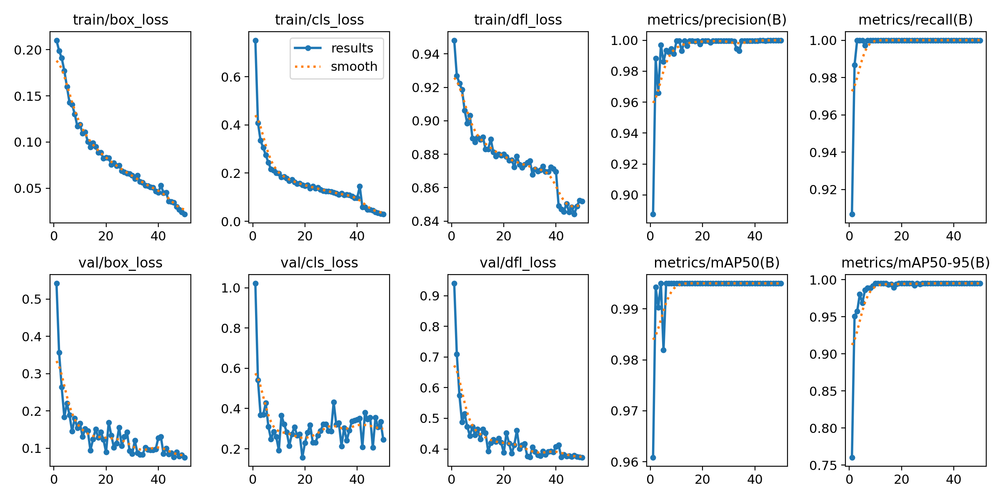

Pertaining to the box loss, class loss, and DFL loss plots of both the training and validation run, all losses are decreasing together. There are no signs of the model overfitting. Our model's average precision at 50% IoU and 50% to 90% IoU in detecting lesions is exceptionally high. 

As for real-time performance, the YOLOv8 model's precision is very high in the sense whereby it avoids false positive bounding box detections very well. In other words, out of all the predicted bounding boxes, many were indeed true positives and actually contained lesions. In addition, the YOLOv8 model has a high recall. This means that the model performs well in identifying all true positives while minimising false negatives.

### Performance on the test split

The YOLOv8 model managed a fitness score of 0.994 (3 decimal places) which is defined as a weighted score that combines the validation metrics such as precision, recall, and mAP into a single score. A minimum IoU of 0.8 for all lesion detections was enforced when testing. With this high of a fitness score, the model detects lesions extremely well. Before testing, overfitting was definitely a worry since the model was performing so well but this was ruled out since the model also performed very well on the test data. 

The plots of the model's precision-recall curve, F1-confidence curve, precision-confidence curve, and recall-confidence curve on the test split are presented below in order.

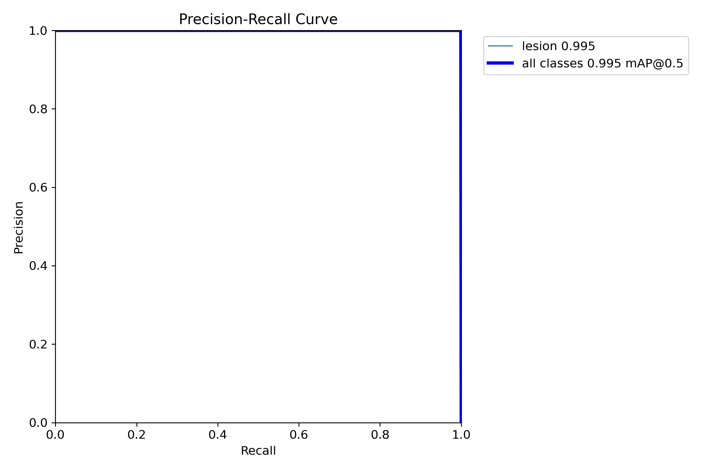

As seen from the precision-recall plot above, the curve sticks to the top-right hand corner. This means that the model has both high precision and high recall levels at the same time. This means that the model is performing extremely well because there usually exists a trade-off between precision and recall at varied thresholds. Then, the large area under this curve means that the YOLOv8 model used has a high average precision with false positives minimised. 

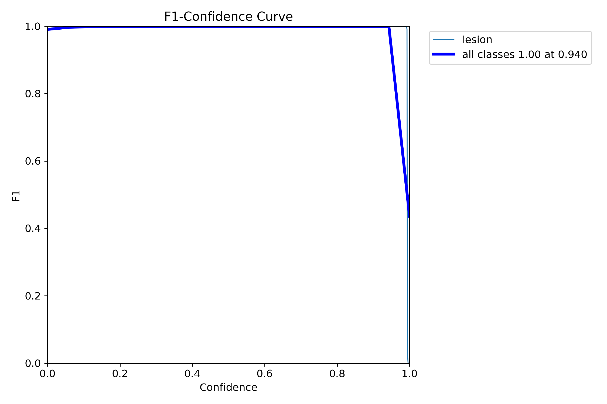

F1-confidence plots work best for identifying the optimal confidence threshold where a model's level of precision and recall are well-balanced. In our context, as seen in the plot above, the YOLOv8 model well maintains a very good balance between levels of precision and recall. The F1 score remains high across various thresholds. Only over a confidence level of 0.9 does the model's recall begin to drop and so does the F1 score. Overall, this means that the YOLOv8 model is performing well.

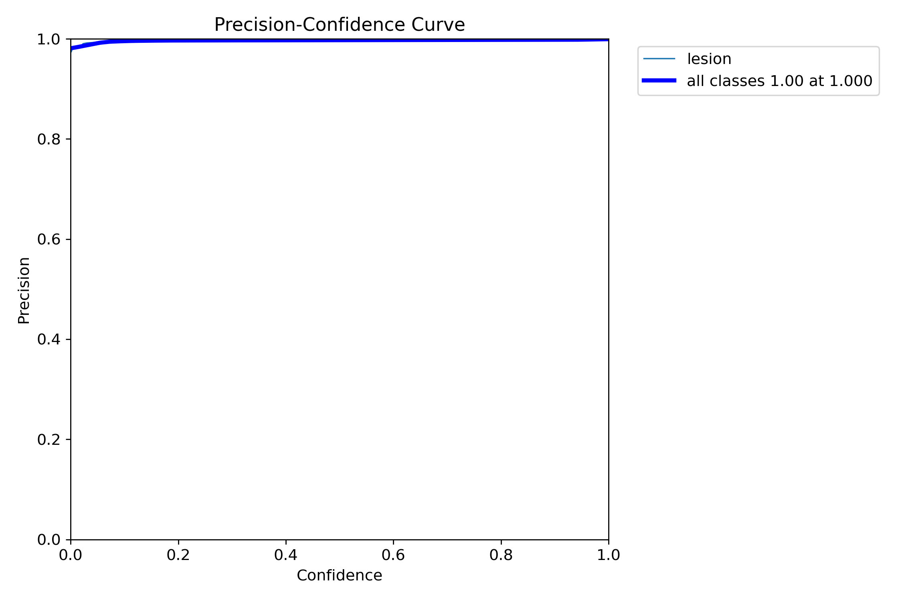

In the precision-confidence curve above, the model's precision increases as confidence increases. The model's precision values remain extremely high (close or equal to 1.0) at all different thresholds. This means that the YOLOv8 model performs exceptionally well at avoiding false positives.

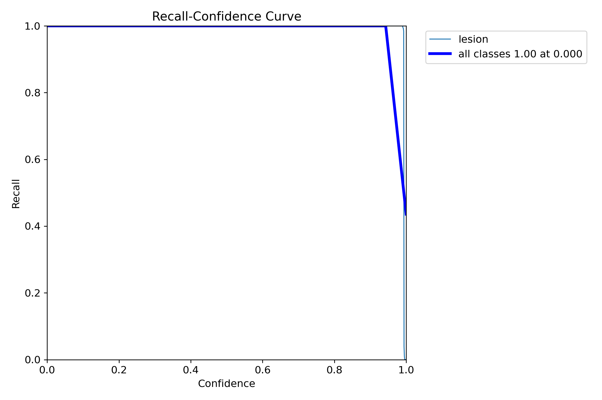

Lastly, in the recall-confidence curve above, the model's recall values are extremely high across varied confidence thresholds. As seen in the plot above, the model's recall only starts to decrease near a confidence level of over 0.9. This ties it all together and shows that the YOLOv8 model is indeed performing extremely well in detecting lesions as there usually exists a trade-off between a model's level of recall and confidence. 

Next, the pictures presented below show the validation batch labels and the validation batch predictions respectively. YOLO validation batch labels depict the ground truth labels for distinct batches from the validation split. On the other hand, YOLO validation batch predictions display the predictions made by the model for those same batches. It can be seen that both show the exact same bounding boxes in the same positions. This means that the YOLOv8 model's predictions perfectly match the labeled images, which is consistent with the rest of our findings thus far.

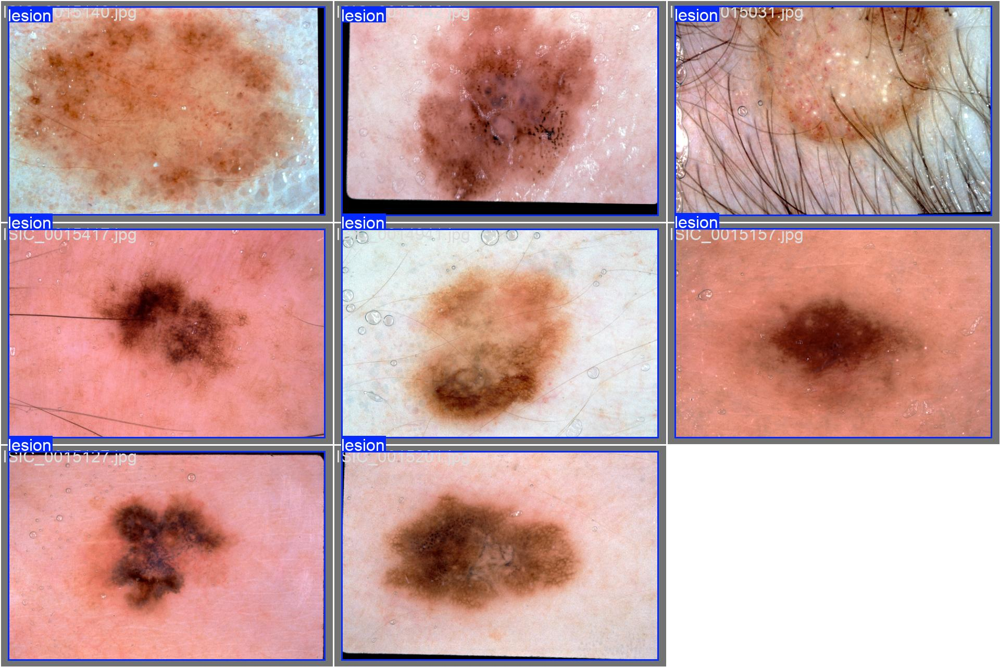

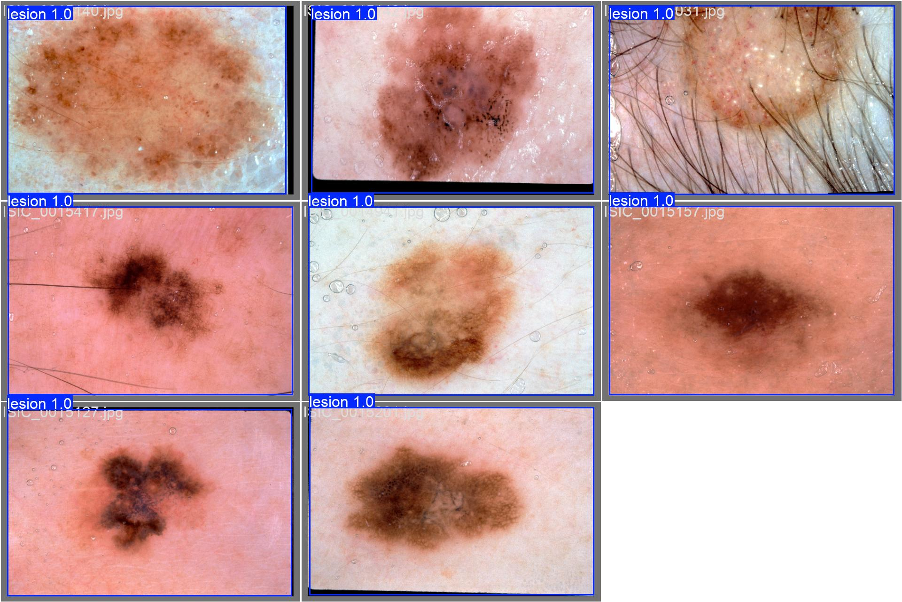

From the results from the training and validation phase, all the plots given above, as well as the batch labels and predictions, it can be concluded that the YOLOv8 model is highly accurate in detecting lesions, even on unseen data. The findings are all very good and do not, in any way, contradict one another. In addition, there is no evidence of the model overfitting. Thus, it can be concluded that the YOLOv8 model simply performs extremely well in its task of lesion detection.

### Example Inputs and Outputs

In predict.py, the model can be fed a single input image or a folder of images. This can be adjusted at the bottom of the predict.py file as such:

    predict_image(model, source_path)  # change source path accordingly to input image(s)

For the sake of this report, the following examples will show single input images and their respective outputs. If the model does not detect any lesions in the input image, the terminal console will print "no lesions detected". Otherwise, the results of the prediction will be saved under a "runs/predict" directory. The class name (lesion), the bounding box coordinates, and the confidence of the model that the bounding box contains a lesion will also be printed in the terminal console. 

The following shows an example input image fed into the trained YOLOv8 model, along with the predicted output made by the model.

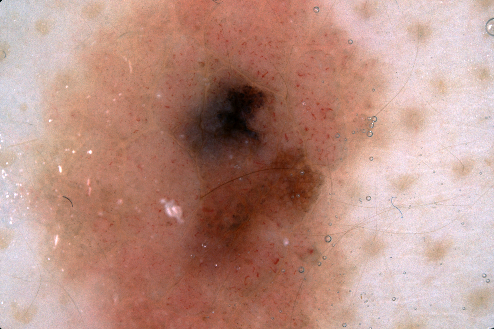
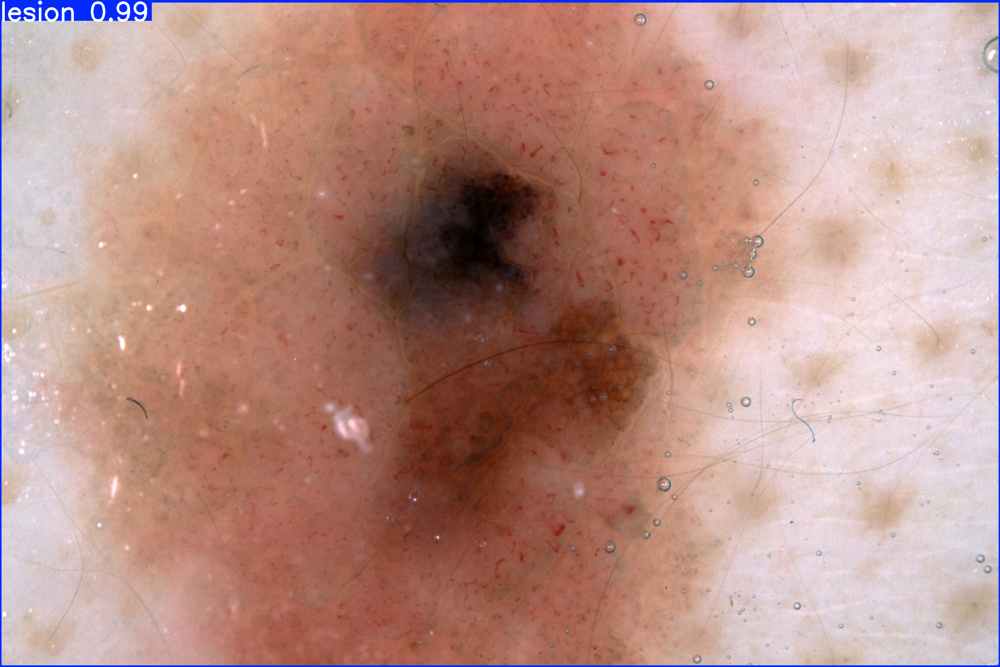

In addition, the following results were printed in the terminal console after running predict.py:

        class: lesion
        confidence: 0.99
        box: [0.0, 7.995407581329346, 6648.0, 4437.119140625]
        done predicting

This means that the already trained YOLOv8 model detected a lesion in the input image with a confidence of 99%, with the bounding box coordinates for where the lesion was found in the input image given by [0.0, 7.9954, 6648.0, 4437.1].

The following shows another example input image fed into the same trained YOLOv8 model, along with the predicted output made by the model.

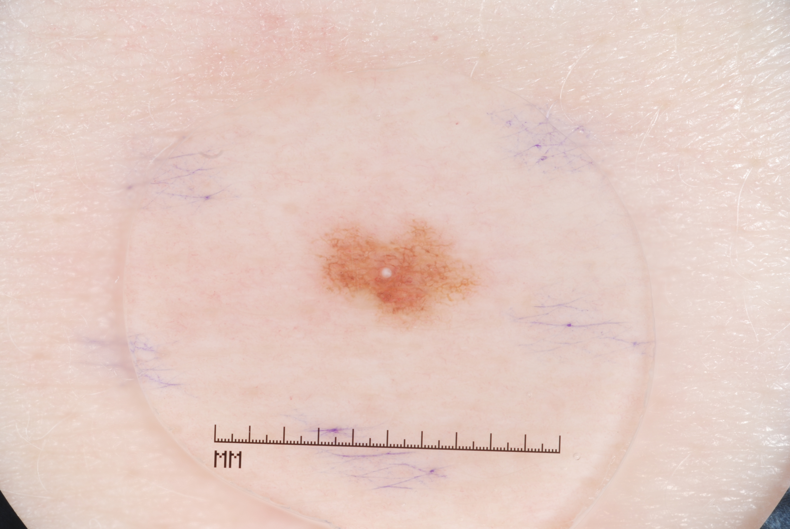
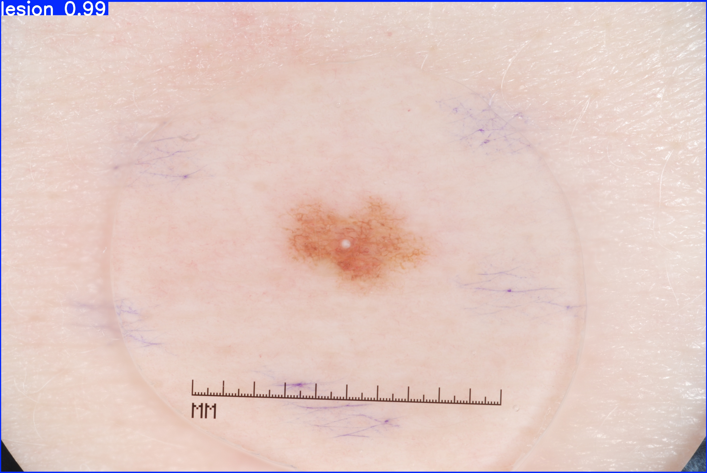

The following results were printed in the terminal console after running predict.py:

        class: lesion
        confidence: 0.99
        box: [0.0, 4.3296051025390625, 3872.0, 2590.019775390625]
        done predicting

This means that the already trained YOLOv8 model detected a lesion in the input image with a confidence of 99%, with the bounding box coordinates for where the lesion was found in the input image given by [0.0, 4.3296, 3872.0, 2590.0].

From these two example inputs and outputs, the trained YOLOv8 predicted a lesion correctly and with a high confidence of 99%. This means that the model is very capable in detecting features that indicate the existence of a lesion. There is thus, highly reliable feature extraction together with a very high model accuracy. These example inputs and outputs align with the rest of the findings of the YOLOv8 model. It can be concluded that the YOLOv8 model is highly accurate in detecting lesions in images, effectively minimising both false negatives as well as false positives. 

