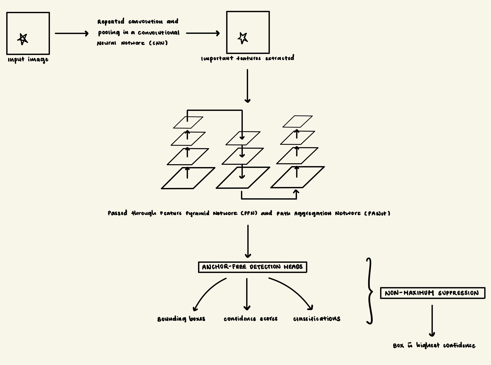

# Recognition Task 5: Lesions Detection with YOLOv8

---

## Overview of Algorithm

### Description of Algorithm
This report uses the You Only Look Once (YOLO) v8 model. YOLO models are single stage object detectors which are deep learning models that are able to find and identify objects in a single pass through a Convolutional Neural Network (CNN). Unlike two-stage object detectors, YOLO models immediately predict bounding boxes and classes from the image in a single pass. YOLOv8 differs from its earlier versions by enabling anchor-free detection, whereby object centres' coordinates and bounding boxes dimensions are directly predicted instead of being predefined. YOLO models are widely used for modeling object detection as they are faster, trainable on a single GPU, and can be used for real-time detection. YOLOv8 achieves this with very high accuracy.

### How YOLOv8 Works
In a YOLO model, the input image is passed through the CNN's backbone. This step extracts important features that YOLO will use to find and classify objects. Such features may include: textures, shapes, and object edges. These features are combined by the "neck" using the Feature Pyramid Network (FPN) and Path Aggregation Network (PAN). This enables objects of varying sizes to be detected. In this report, YOLOv8 is used to detect lesions. As the merged features are passed to the anchor-free detection head of YOLOv8, bounding boxes, the confidence of the model regarding the existence of said object, and class probabilities are predicted. Unlike earlier versions, YOLOv8 is anchor-free and predicts object centers straightaway. Each of YOLO's detection grid cell outputs a few of such predictions, which includes their respective confidence scores. Finally, YOLO uses Non-Maximum Suppression (NMS) to filter overlapping boxes, resulting in one bounding box with the highest confidence score.

The figure below presents a simple diagram of YOLOv8's architecture and algorithm.

---

## Data Pre-processing

### Processing data for compatibility with YOLOv8
Firstly, each raw image and its corresponding mask is read. Subsequently, the regions where the lesions are located are extracted from these masks. These regions are then converted into bounding boxes and feature scaling occurs whereby coordinates are normalised. From these steps, we derive the YOLO-format labels (as of required of the algorithm) for each image which are saved as .txt files. An additional step of organising the file structure into images and labels separately was implemented. This was done to prevent confusion when handling the data in later parts.

### Training, Validation, Testing splits
The dataset provided already came with the training, validation, and testing splits of the data. I followed these splits as such.

---

## Dependencies and Reproducibility

### Dependencies
Python libraries and their respective versions required have been placed into the "requirements.txt" file. For reference, the dependencies are also listed below.
    
    matplotlib==3.10.7
    numpy==2.2.6
    opencv-python==4.12.0.88
    PyYAML==6.0.3
    requests==2.32.5
    scipy==1.15.3
    torch==2.9.0
    torchvision==0.24.0
    ultralytics==8.3.218
    ultralytics-thop==2.0.17

### Reproducibility

Firstly, download the ISIC 2017 dataset from the link provided below if needed:

<https://challenge.isic-archive.com/data/#2017>

Once this repository has been cloned or downloaded, install dependencies by running:
    
    pip install -r requirements.txt

After all dependencies have been installed, run "dataset.py" just once to process the data. Once the data has been processed, run "train.py" to train, validate, test, and save the model.

Training parameters are as follows:

    data="/Users/suyi/Desktop/3710/ISIC-2017/isic2017.yaml",  # or replace with path to .yaml file
    epochs=num_epochs,  # number of training epochs
    imgsz=640,  # image size
    batch=8,
    name="lesion_detector",  # name of run to be saved 
    project="runs/train",  # name of folder to be saved
    verbose=True

